# Journal for building the website

- Wanted to move fast so avoiding tooling and crafting the html / css / js from scratch
- With the flowers I wanted to maintain the original image, however when performing absolute positioning, I had issues around doing a negative right position to do the clipping I wanted. Instead I clipped the image manually and just did right 0.

Optimisations:

- Resize images close to the actual size I was intending to use them. Then run through the Optimizilla file compression. In most cases I was able to compress 5-80% of a raw image.
  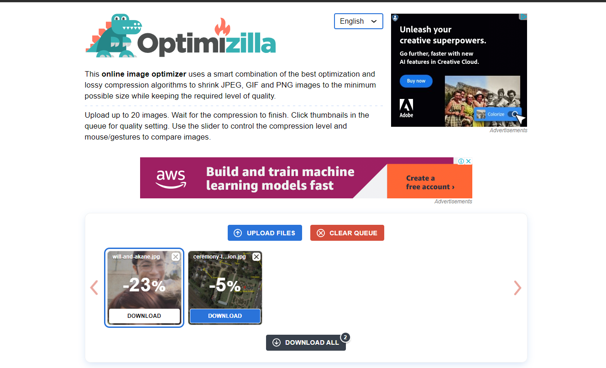

- With the heading, I wanted a nice cursive font. I contemplated doing this as an image asset to reduce the cost of importing a font, however an image is less accessible and also less semantic since this should be the heading of our website.
  
- The cost of the font we chose "better-grade" was 72kb.
- However we were only using the letters:
  - A k a n e & W i

Downloading FontForge, I found a way to remove unused characters.

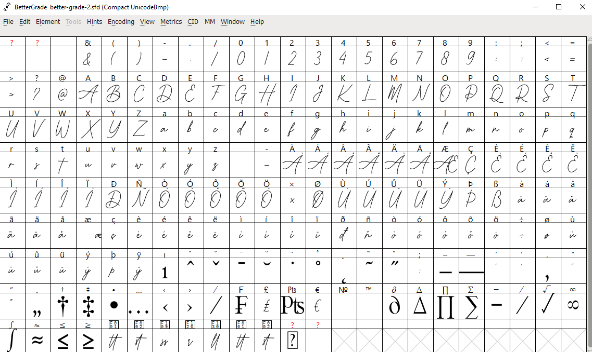

The UI wasn't as intuitive as I'd liked and I had some issues with export on the first go, but overall [this stackoverflow post](https://stackoverflow.com/questions/12976424/how-to-remove-characters-from-a-font-file/30264854#30264854) helped with removing all the characters I didn't need.

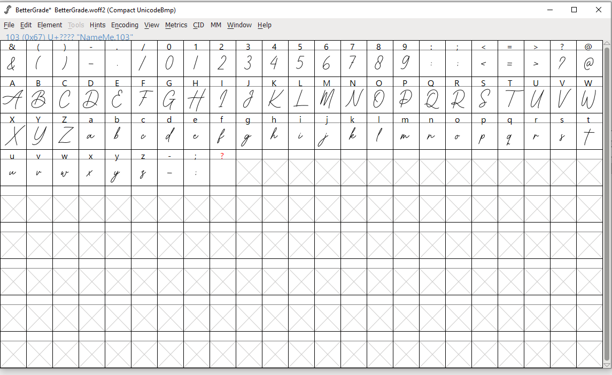

Slimming down to letters, numbers, and special characters (removing ligatures)

Sometimes it would refuse to generate the fonts and sometimes I would just get warnings.

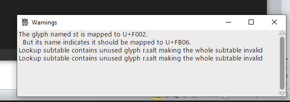

Managed to slim it from 72 to 16kb!

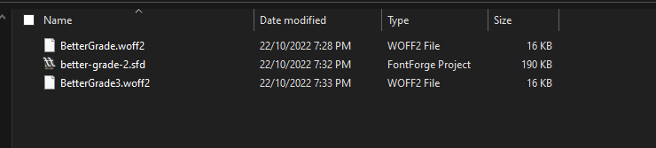

## Carousel

I wanted to add a carousel to display multiple images of us.

On load, all the images in the carousel would download to the browser even when marked as lazy.

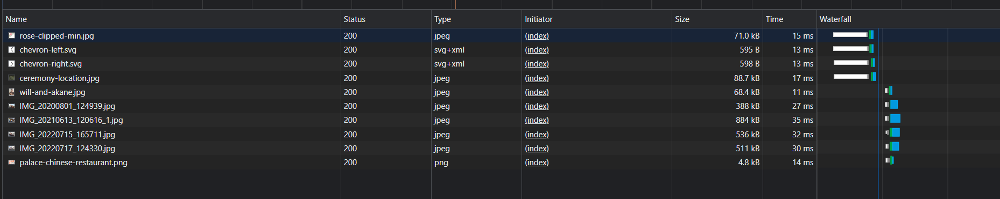

Changing the dom so that only the first image would have a src but every other image would have a data-src, and then adding an event listener to when each slide was visible

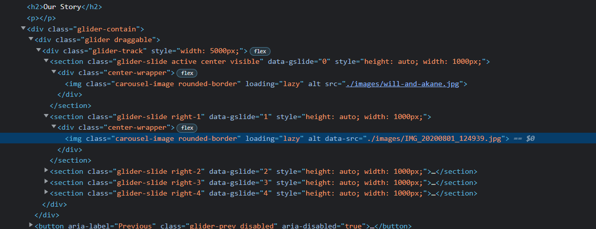

And we can get:

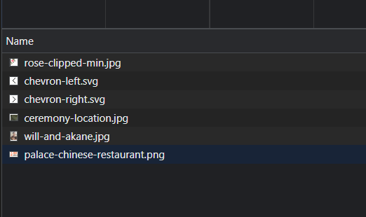

The carousel controls were also being loaded as 2 separate assets, event though visually they are just mirror images of one another.

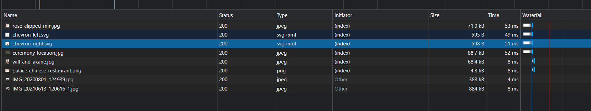

## Animating title

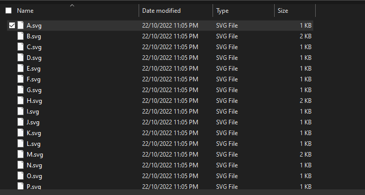

https://css-tricks.com/svg-line-animation-works/
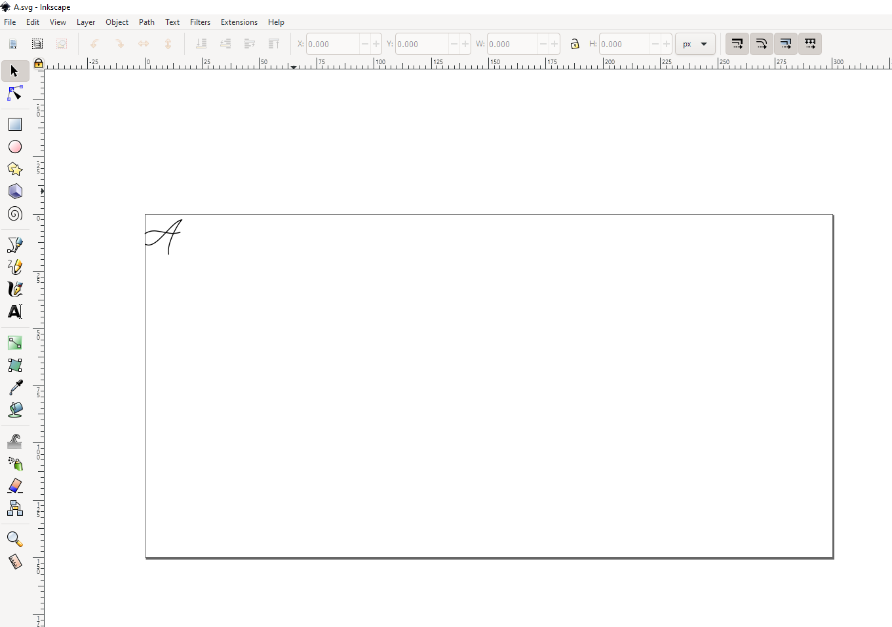

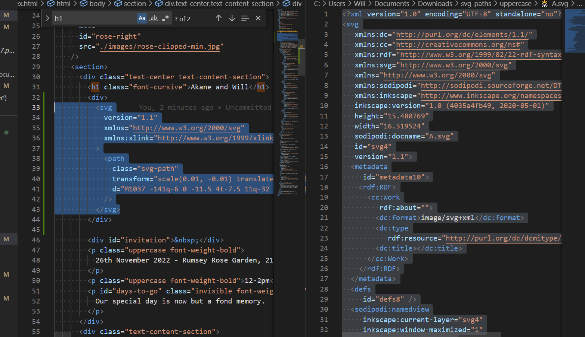